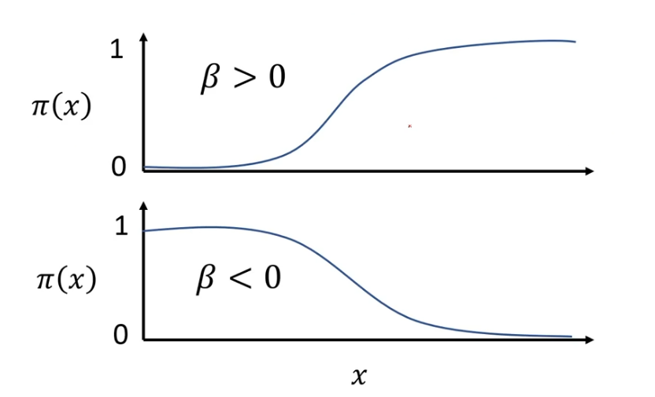
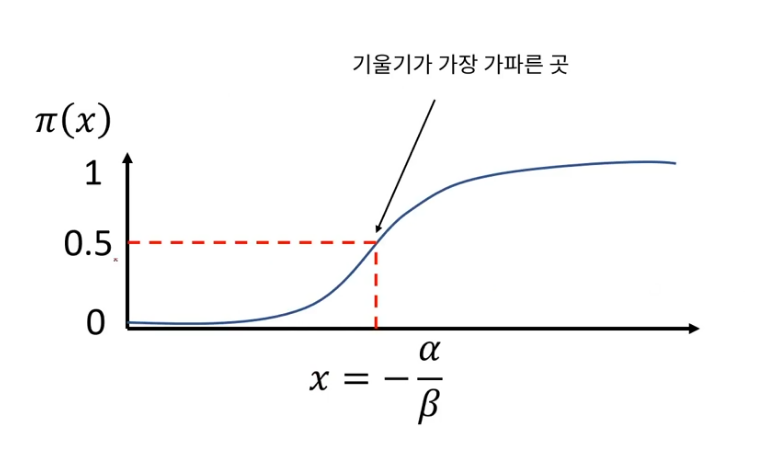
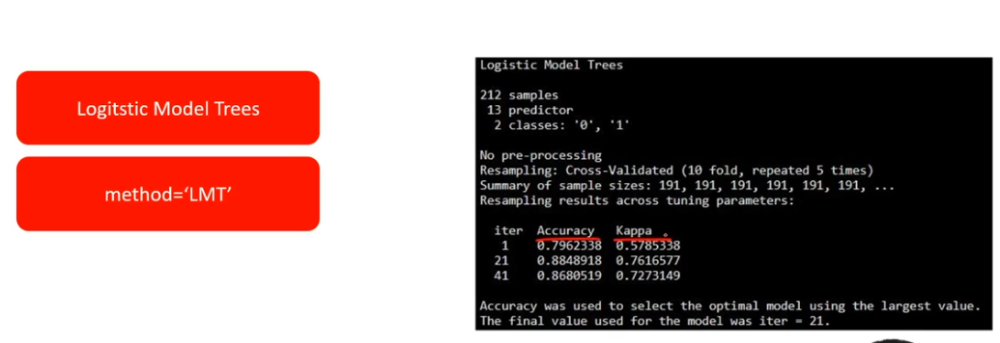
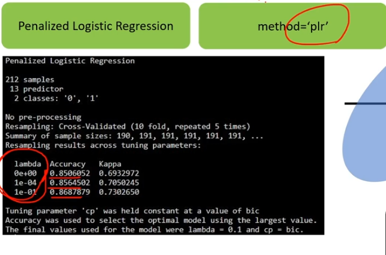
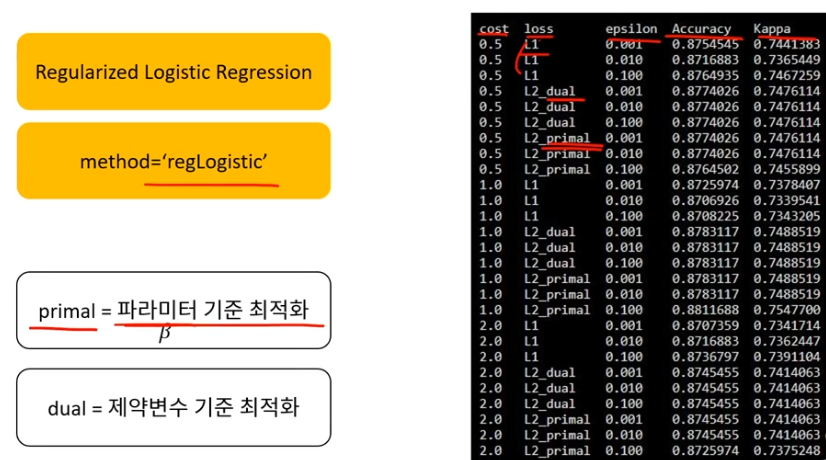
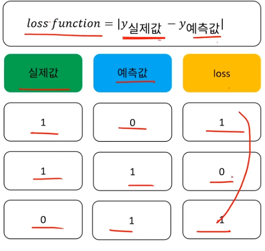
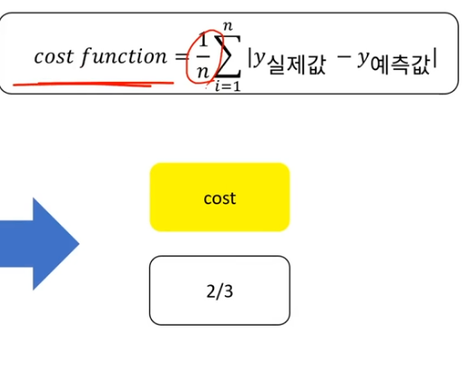

1.  **Logistic Regression 개념**

-   선형회귀분석 --\> 종속변수 = 연속형 숫자 , 범주 X

-   로지스틱회귀분석 (종속변수가 연속형, 범주형 둘다 가능! 단, 조건이 있다)

    -   종속변수가 연속형일 경우: 제한이 있으며, 가능한 범위가 있다.

    -   종속변수가 범주형, 연속X

|                   | 선형 회귀분석 | 로지스틱 회귀분석 |
|-------------------|---------------|-------------------|
| **종속변수 형태** | 연속형        | 연속형, 범주형    |
| **종속변수 범위** | 제한없음      | 제한있음          |

-   종속변수의 범위가 제한 있는 경우

    -   0 \< 종속변수 \< 1

        -   분류 : 0 또는 1

        -   예측 : 1일 확률 , 0일 확률

2.  **Logistic Regression 탄생 배경**

$z = a + bx$ (z : 종속변수, 타겟 / x : 독립변수, 피처 / a : 절편 / b : 기울기)

위의 식은 선형회귀이므로 z 값에 제한이 없다. 따라서 우리는 z값에 제한이 있도록 식을 변형시켜줘야한다.

$y = \cfrac{1}{1+ e^{-z}}$ $= \cfrac {1}{1+e^{-(a+bx)}}$

위의 식은 시그모이드 함수이며, y 는 z의 변형을 통해 만들어진 새로운 변수이다.

위의 식을 변형하면 아래와 같은 식이 된다.

$\log(\cfrac{y}{1-y}) = a + bx$

그 다음 $y$ 표기법을 $\pi(x)$ 으로 변경할건데, $\pi(x)$ 는 X= x일 때, Y=1일 확률이다.

즉, $\pi(x) = P(Y=1 |X = x)$

그러면 $logit(\pi(x)) = \log(\cfrac{\pi(x)}{1-\pi(x)}) = a + bx$ 을 만족한다.

$\cfrac{\pi(x)}{1-\pi(x)}$ 는 오즈비(odds ratio)라고 한다 ex) 양성확률은 음성확률의 몇배인가?

$\pi(x)= P(Y = 1 | X = x)$ 를 의미하므로, $1 - \pi(x)는 = P(Y = 0 | X = x)$ 이다.

따라서, $logit(\pi(x)) = \log(\cfrac{P(Y = 1 | X = x)}{P(Y = 0 | X = x)}) = a + bx$ 가 성립한다.

-   베타의 부호에 따른 그래프 모양 변화



-   **기울기가 가파른 곳**



$\pi(x)$ 의 값이 0.5을 기준으로 기울기가 급격히 증가하는 것을 알 수 있다.

즉, 1의 확률에 가깝다는 의미이다.

그렇다면 우리는 y의 값을 얼마를 기준으로 1에 가깝다고 말할 수 있는가?

정답은 0.5이다. 왜냐하면 위의 그래프에서도 알 수 있듯이, 0.5를 기준으로 기울기가 급격히 증가하는 것을 알 수 있기 때문이다.

-   기울기가 크다는 말의 의미

**기울기가 크다?** --\> **x가 조금만 증가해도 1일 확률이 급격히 증가한다.**

3.  **실습**

앞 시간에서와 마찬가지로 caret 패키지를 이용하여 실습을 진행할 것이다.

``` r
library(caret)

# LogitBoost 
ctrl <- trainControl(method = "repeatedcv", repeats = 5)
logitFit <- train(target~.,
                  data = train,
                  method = "LogitBoost", # 원하는 로지스틱 모형 선택
                  trControl = ctrl,
                  metric = "Accuracy")
logitFit
```

-   로지스틱 회귀분석 종류

로지스틱 회귀분석에는 여러가지 종류가 있는데, 그 중에서도 사람들이 많이 사용하는 4가지가 있다.

1.  **Boosted Logistic Regression / method = "LogitBoost"**

    -   Boosted Logistic Regression : 약한 모델들을 여러 번 더하면서 강한 모델로 만드는 방법이다.

    -   약한 모델들은 정확도가 낮기때문에 그러한 것들을 여러 번 더하면 정확도가 높아지면서 강한 모델이 만들어진다.

2.  **Logistic Model Trees / method = "LMT"**

    -   Logistic Model Trees : 로지스틱과 트리구조를 합친것이다.

3.  **Penalized Logistic Regression / method = "plr"**

    -   모형의 기울기에 제한을 주는 방법이다.

    -   $\Sigma\beta^2<t$

    -   L2정규화(=릿지, Ridge)

    -   정규화를 하는 이유?

        -   모델의 복잡성 조절하기 위함($\beta$ 제한 X --\> complexity)

        -   오버피팅 피하기 위함

4.  **Regularized Logistic Regression / method = "regLogistic"**

    -   L1 정규화 (=라쏘, lasso)

    -   $\Sigma|\beta|<t$

-   Logistic Model Trees



iter : 반복횟수 / Accuracy , kappa : 모형 평가 방법

-   **Penalized Logistic Regression**



$\lambda\Sigma\beta^2$ --\> lambda 가 시그마 앞에 곱해져있는 상태

$\lambda$ 의 크기에 따라 $\beta$ 영역 크기가 달라진다.

-   **Regularized Logistic Regression**



primal : 파라미터 기준 최적화 (파라미터 : 모형에서의 기울기 또는 절편을 의미한다)

dual : 제약변수 기준 최적화 (제약변수 : $\lambda$ 를 뜻함)

-   cost와 loss의 차이

{width="318"}



lost : for 각각의 데이터 포인트

cost : for 전체 데이터셋

4.  실습 (심장병 유무 모델)

```{r}
rawdata <- read.csv("Date/heart.csv", header = T)
rawdata
str(rawdata) # targer 변수를 보니 int유형이므로 factor로 바꿔야한다. 

# 타켓 클래스 범주화 
rawdata$target <- as.factor(rawdata$target)
unique(rawdata$target)

# 연속형 -> 표준화(단위가 다르기때문) / 범주형 -> 범주화

## 연속형 독립변수 표준화 
rawdata$age <- scale(rawdata$age)
rawdata$trestbps <- scale(rawdata$trestbps)
rawdata$chol <- scale(rawdata$chol)
rawdata$thalach <- scale(rawdata$thalach)
rawdata$oldpeak <- scale(rawdata$oldpeak)
rawdata$slope <- scale(rawdata$slope)

## 범주형 독립변수 as.factor
newdata <- rawdata
factorVar <- c("sex","cp","fbs","restecg","exang","ca","thal")
newdata[,factorVar] = lapply(newdata[,factorVar], factor)

# 트레이닝, 테스트 셋으로 나누기 
## 트레이닝, 테스트 나누기 (7:3)
set.seed(2023)
datatotal <- sort(sample(nrow(newdata), nrow(newdata)*0.7))
train <- newdata[datatotal,]
test <- newdata[-datatotal,]

train_x <- train[,1:12]
train_y <- train[,13]

test_x <- test[,1:12]
test_y <- test[,13]

# LogitBoost method (모형 개발)
ctrl <- trainControl(method = "repeatedcv", repeats = 5)
logitFit <- train(target~.,
                  data = train,
                  method = "LogitBoost",
                  trControl = ctrl,
                  metric = "Accuracy")
logitFit # 31번 반복을 할 때가 정확성(75%)이 가장 높은 것을 알 수 있다.

plot(logitFit) # plot

# 모형 예측
# 위에서 train데이터로 모형을 개발했을 때 정확성보다 높은 83%의 정확성을 나타냈다. 

pred_test <- predict(logitFit, newdata = test)
confusionMatrix(pred_test, test$target)

# 변수 중요도
importance_logit <- varImp(logitFit, scale = F)

# ca라는 변수가 타겟변수에 영향을 가장 많이 준다는 것을 알 수 있다. 
plot(importance_logit)  
```
