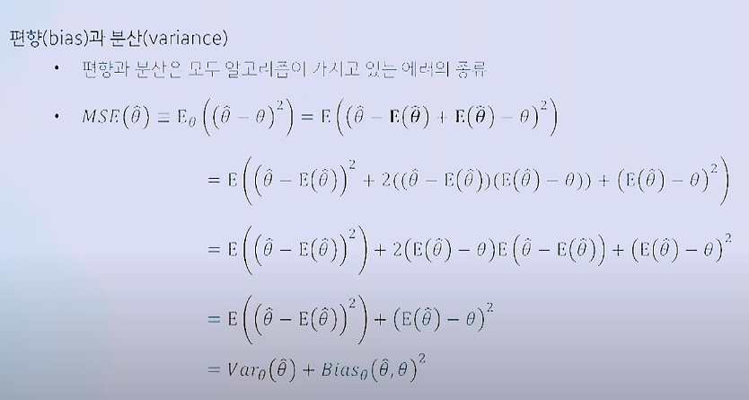
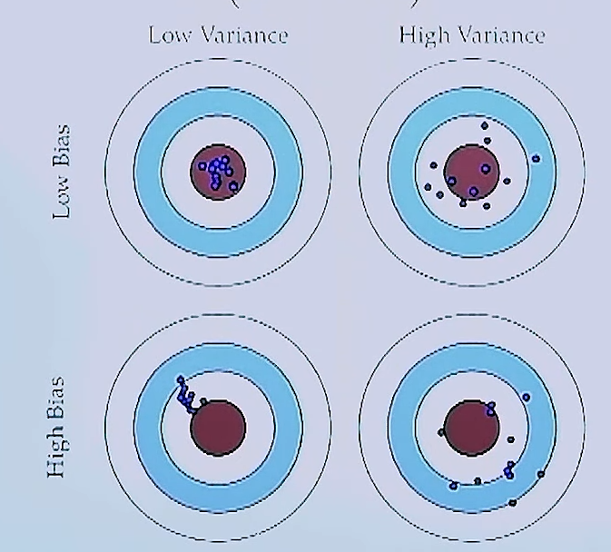
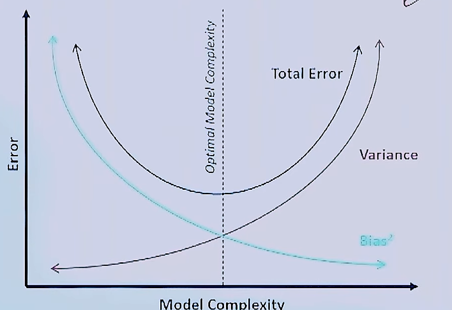
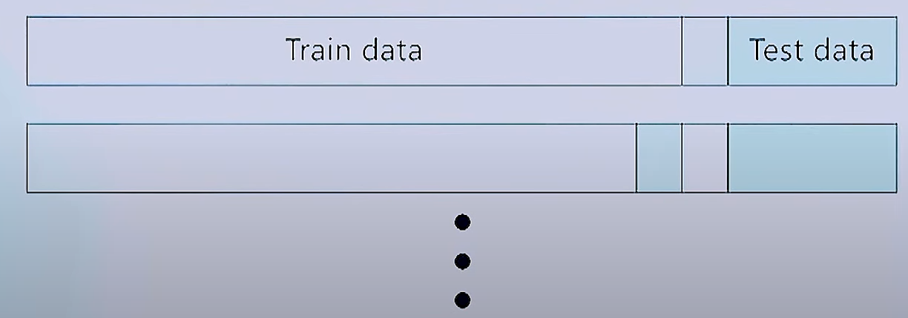
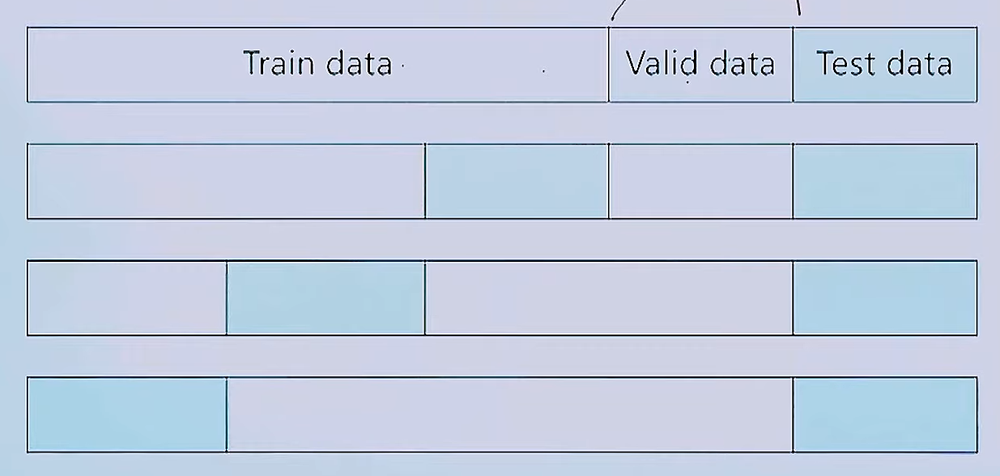
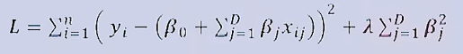
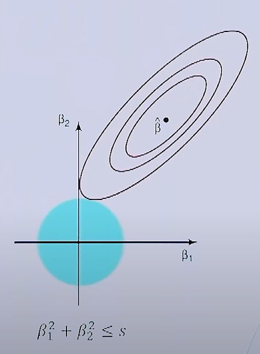
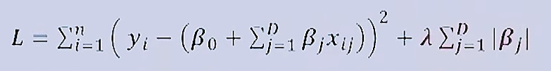
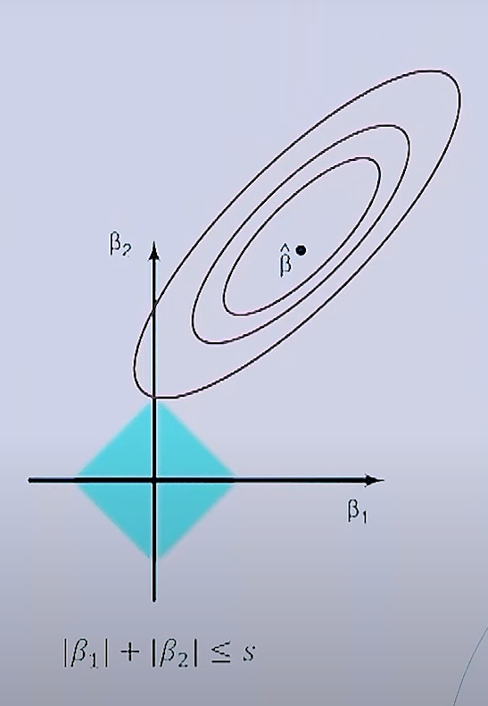

### Bias & Variance (편향과 분산)

1.  **데이터의 분할**

-   입력된 데이터는 학습데이터와 평가데이터로 나눌 수 있다.

-   학습데이터는 모델 학습에 사용되는 모든 데이터셋

-   평가데이터는 오직 모델의 평가만을 위해 사용되는 **데이터셋**

-   **평가데이터는 절대로! 모델 학습에 사용되면 안된다.**

2.  **평가데이터에 대한 궁금증!**

-   학습 데이터와 평가 데이터는 같은 분포를 가지는가?

    -   전체 데이터셋에서 랜덤하게 나누기떄문에 일반적으로 같은 분포를 가진다.

-   평가 데이터는 어느 정도 크기를 가져야 하는가?

    -   평가데이터는 전체데이터셋에서 대략 10\~20%의 부분을 차지한다.

3.  모델의 복잡도

-   선형에서 비선형 모델로 갈수록(파라미터의 갯수가 증가), 모델의 복잡도가 증가한다.

-   모델이 복잡해질수록, 학습 데이터를 다 완벽하게 학습한다.

-   그러면 좋은가?

    -   데이터가 많은 상황(Under-fitting)

        --\> 모델의 복잡도가 증가할수록, 학습데이터의 정확도가 점점 증가한다. 반면 모델의 복잡도가 낮을수록, 학습데이터의 정확도가 점점 감소한다.

        \--\> 선형(모델의 복잡도 감소): 파라미터의 갯수가 적다.

        \--\> 비선형(모델의 복잡도 증가) : 파라미터의 갯수가 많다

    -   데이터가 적은은 상황(Over-fitting, 과 적합)

        -\> 학습데이터 기준으로 볼 경우: 선형 -\> 비선형으로 변화하는 경우, 정확도가 높아지는 반면 평가데이터는 그만큼 오차가 커지므로 정확도가 낮아진다.

        요약하자면, 모델의 복잡도가 증가할수록, 학습데이터에 대한 정확도는 커진다.

        (언더피팅)

        하지만, 실제로 평가데이터가 학습데이터와 다른 분포를 띄게 된다면, 평가데이터의 정확도는 낮아진다. (오버피팅)

        그리하여 무작정 모델의 복잡도 즉, 파라미터의 수를 늘리는 행위가 꼭 정답은 아니다라는 것을 인지 할 수 있다.

4.  편향과 분산

-   편향과 분산은 모두 알고리즘이 가지고 있는 에러의 종류이다.

    

-   $(E(\hat{\theta})-\theta)^2$ = $Bias_\theta(\hat{\theta},\theta)^2$ --\> 편향(학습데이터 정확도와 관련)

-   $E((E(\hat{\theta})-\theta)^2)$ = $Var_\theta(\hat{\theta})$ --\> 분산

-   $MSE(\hat{\theta}) = (E(\hat{\theta})-\theta)^2 + E((E(\hat{\theta})-\theta)^2) =Bias_\theta(\hat{\theta},\theta)^2 + Var_\theta(\hat{\theta})$

{width="439"}

-   빨간색 원 $\theta$ 영역 / 파란색 영역 $\hat{\theta}$

-   위의 그림처럼 분산과 편향의 영역을 4가지로 분류할 수 있다.

-   편향은 under - fitting과 관련 있는 개념

-   분산은 over - fitting과 관련 있는 개념

{width="501"}

**해결방안**

-   일반적으로 모델의 복잡도를 키우고, 과적합을 막는 방법론을 사용.

    1.  검증 데이터셋을 활용
    2.  k-fold cross validation
    3.  정규화 손실 함수

-   검증데이터셋

    -   모델 학습의 정도를 검증하기 위한 데이터셋

    -   모델 학습에 직접적으로 참여하지 못함

    -   학습 중간에 계속해서 평가를 하고, 가장 좋은 성능의 파라미터를 저장해 둔다.

    -   모델 학습에 참여하지 X (Test data와 공통점)

1.  **Leave-One-Out Cross - Validation**

LOOCV (valid data가 1개인 데이터셋이 n개 있는 경우)

-   랜덤으로 생성된 valid data (검증 데이터셋) 하나는 편향된 결과를 줄 수도 있다.

-   검증 데이터셋에 포함된 샘플들은 모델이 학습할 수 없다.

-   간단하게 모든 데이터 샘플에 대해서 검증을 진행할 수 있다.

-   하지만 모델이 많을수록 계산 비용이 증가하게 되는 문제점이 존재한다.

2.  **K-fold cross validation**

-   LOOCV의 경우 계산 비용이 매우 큰 단점이 존재한다.

-   이러한 문제를 해결하기 위해, K개의 파트를 나누어 검증을 진행하는 방법이다.

-   Ex. 4-fold 교차 검증

-   Question)

    -   K의 값이 커지면, 어떤 것이 바뀌는가?

        1.  학습 데이터의 수
        2.  Bias 에러값, Variance 에러값
        3.  계산 비용

    -   K의 값이 커지면, LOOCV와 동일하게 된다. 그로 인해 학습데이터의 수는 커지게 되기 때문에 Bias 에러값이 작아진다. 그와 반대로 Vairance 에러값은 커지게 된다. 당연히 계산비용은 커진다.

**Regularization** (손실함수와 관련)

-   정규화 손실 함수

    -   모델의 복잡도가 커진다 == 모델의 파라미터 수가 많아진다

    -   모델의 복잡도가 커질수록, 과적합(over - fitting)이 발생할 가능성이 커진다.

    -   복잡도가 큰 모델을 정의하고, 그 중 중요한 파라미터만 학습하면 안되는 것인가?

    -   필요없는 파라미터 값을 0으로 만들자!

-   정규화 종류

    -   Ridge 회귀(L2 regression)

    -   Lasso 회귀(L1 regression)

1.  Ridge 회귀

-   MSE 손실을 줄이지 못하면 패널티 항의 손실값이 더 크게 작용한다.

-   $\lambda$ (람다)는 정규화의 영향을 조절하는 하이퍼파라미터이다.

-   정규화 식이 제곱의 합으로 표현된다.

-   Ridge 회귀를 기하학적으로 표현하면 다음과 같다.

결론적으로, MSE 등고선과 원의 교점이 MSE 손실함수의 최적화인 부분이다.

위의 그림에서는 파라미터의 수가 2개만 존재하므로 0의 값이 없지만, 파라미터의 수가 몇만개가 존재하는 경우에서는 0의 값이 존재한다.

2.  Lasso 회귀

위의 식은 MSE 함수에 Lasso 회귀가 더해진 식이다.

-   MSE 손실을 줄이지 못하면 패널티 항의 손실값이 더 크게 작용한다.

-   $\lambda$ 는 정규화의 영향을 조절하는 하이퍼파라미터이다.

-   정규화 식이 절댓값의 합으로 표현된다.

-   Lasso 회귀를 기하학적으로 표현하면 다음과 같다.

-   위의 그래프에서 알 수 있듯이, MSE등고선과 마름모와의 교점은 $\beta_1=0$ , $\beta_2=S$ 이다. 해의 의미는 불필요한 파라미터 $\beta_1$ 이고, 이 부분을 지워서 over-fitting, Variance-error 줄여보겠다 라는 것이다.

-   정규화의 목적은 복잡한 모델의 경우, 파라미터의 수가 많아지기 때문에 불필요한 파라미터의 값을 0으로 만드는 것이다. 그로인해서 파라미터의 값이 음수,양수이든 간에 0과의 차이를 봐야하기 때문에 절댓값(\| \|)을 씌운 것이다.

-   Question

    -   $\lambda$ 가 커지면, 불필요한 파라미터를 0으로 만드는 강도가 커지기때문에 실제 모델의 복잡도가 줄어든다. 그로 인해 Bias에러값은 증가하고, Variance에러값은 감소한다.

    -   파라미터의 희소성 정도 : Ridge 정규화, Lasso 정규화

        -   Lasso 정규화를 기하학적으로 표현했을 때 파라미터의 값이 0이 존재했으므로, 파라미터 희소성 정도 기준에서 비교했을 때 Lasso 정규화가 더 희소성이 있다.

    -   0의 값을 가진 파라미터가 더 많아지게 하는 방법?

        -   $\lambda$ 값의 증가

        -   지수 값을 감소
