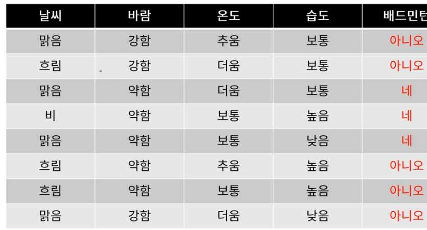
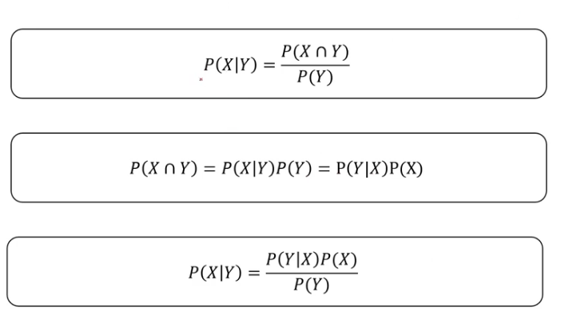
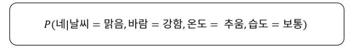
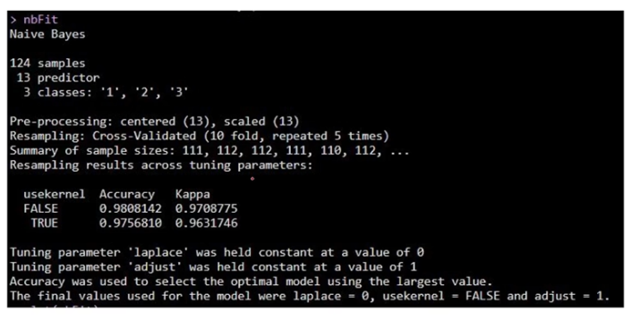
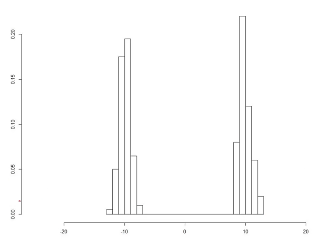
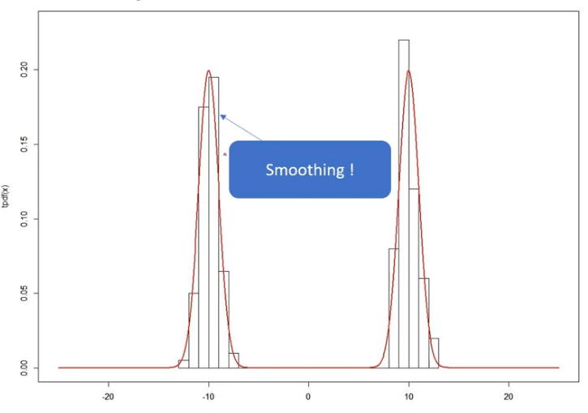
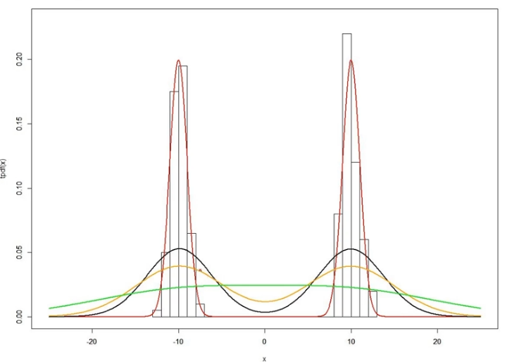

## Naive Bayes Classification

-   **Bayes : 확률의 베이즈정리를 기반으로 한 내용**

배트민턴 플레이 여부를 알기 위한 모델링 예시를 통해서 Naive Bayes Classification을

설명하려고 한다.



위의 사진을 보면 피쳐는 4개(날씨, 바람,온도,습도)가 있으며, 라벨링이자 타겟은 배드민턴 플레이 여부 변수가 있다.

여기서 피쳐들은 서로 조건부독립이다. 왜냐하면 조건이 주어졌을 때 서로한테 영향이 없기 때문이다.

Naive Bayes Classification을 하려면 베이즈 정리를 꼭 숙지해야한다.

베이즈 정리는 확률, 조건부 확률이 활용한 수학 공식이라고 봐도 무방하다.



위의 사진이 바로 베이즈정리이다. 위에서부터 차례대로 1번이라고 하면, 1번과 2번을 혼합한 식이 3번이 된다.

위의 베이즈 정리를 숙지했다면, 예시로 든 배드민턴 플레이 여부를 알 수 있다.

우리가 최종적으로 알아내고 싶은 것은 배드민턴 플레이 여부이다. 그리고 여부를 알기 위해서는 피쳐들을 조건으로 이용하여 조건부확률을 만들어서 알아내야한다.


](images/paste-8BE68E15.png)

위의 사진은 날씨 = 맑음, 바람 = 강함, 온도 = 추움, 습도 = 보통일 때 배드민턴을 칠 확률과 안 칠 확률이다. 그리고 그 값들을 비교하여 더 큰 값이 해당 조건에서의 여부인 것이다.

### Naive Bayes Classification 사용법

caret 패키지를 이용한다.

``` r
library(caret)

ctrl <- trainControl(method = "repeatedcv", repeats = 5) # train 통제
nbFit <- train(Class~., # 타켓변수~.(피쳐)
          data = train, # 사용할 데이터 
          method = "naive_bayes", # 머신러닝 방법
          trControl = ctrl, 
          preProcess = c("center","scale"), # 전처리 방법 
          metric = "Accuracy") # 모형 평가 방식
nbFit
```

### Naive Bayes Classification 결과의 해석



위의 결과표에서 가장 중요한 것은 **usekernel, adjust, laplace** 이다.

-   **usekernel : 커널밀도추정을 할 것이냐? 라는 질문이다.**

    -   커널밀도추정(Kernel Density Estimation) : 데이터의 히스토그램을 보고 실제 분포를 추정하는 것이다.

{width="389"}

{width="404"}

위의 사진처럼 히스토그램의 각이 져있는 것을 smoothing! 하게 실제 분포를 추정하는 것이다.

-   **adjust : Bandwidth 값을 조절한다는 뜻이다.**

    -   Bandwidth 값이 달라지면 추정 커널밀도함수 형태가 달라진다.



-   Laplace(라플라스 스무딩, Laplace smoothing or Additive smoothing)

    -   Smoothing --\> 부드럽게 (각이 져있는 히스토그램을 부드럽게 만들어준다.)

$\hat{\theta} = \cfrac{x_i + \alpha}{N + \alpha * d}$ (Laplace 공식)

N : 전체 시행 횟수 (전체 데이터 수) / x~i~ : i가 나온 횟수

$\alpha$ : 스무딩 파라미터 (이 값이 0이면 no 스무딩) / d = i (ex. 주사위가 i=1인 경우)

### Naive Bayes Classification 실습 (Feat. 와인 데이터)

1.  **와인 데이터 불러오기**

```{r}
library(caret)

rawdata <- read.csv("Date/wine.csv", header = T)
rawdata
str(rawdata) # Class 변수가 int 형태로 되어 있으므로, factor로 변환환

rawdata$Class <- as.factor(rawdata$Class)
str(rawdata)
```

2.  트레이닝 - 테스트 셋 나누기

```{r}
analdata <- rawdata # 백업데이터 설정

set.seed(2023) # 
datatotal <- sort(sample(nrow(analdata),nrow(analdata)*0.7)) # 

train <- analdata[datatotal,] # train data 
test <- analdata[-datatotal,] # test data 

str(train)

# train data, test data의 x(피쳐)와 y(라벨링)로 나누는 알고리즘도 존재하기 때문에 x와 y로 나누었음.
train_x <- train[,1:13]
train_y <- train[,14]
test_x <- test[,1:13]
test_y <- test[,14]
```

3.  모델 학습

```{r}
ctrl <- trainControl(method = "repeatedcv", repeats = 5) 
nbFit <- train(Class~.,
               data = train,
               method = "naive_bayes",
               trControl=ctrl,
               preProcess = c("center","scale"),
               metric = "Accuracy")
nbFit
# laplace 값 = 0 이며, adjust의 값을 통해 bandwidth값을 1번만 조절했다. 그리고 usekernel = FALSE 이므로 커널밀도추정을 하지 않았다는 것을 알 수 있다. 그렇게 했을 때 Accuracy는 95.9%가 나왔다.
plot(nbFit) # plot 
```

4.  예측

```{r}
pred_test <- predict(nbFit, newdata = test)
confusionMatrix(pred_test, test$Class)
```

5.  **변수중요도**

```{r}
importance_nb <- varImp(nbFit,scale = FALSE)
plot(importance_nb) # 피쳐 하나와 타겟변수의 관계를 ROC 커브화 시켜 면적이 넓을 수록 중요도 상승한다. 
```
