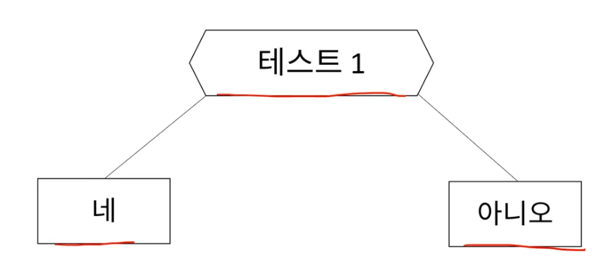
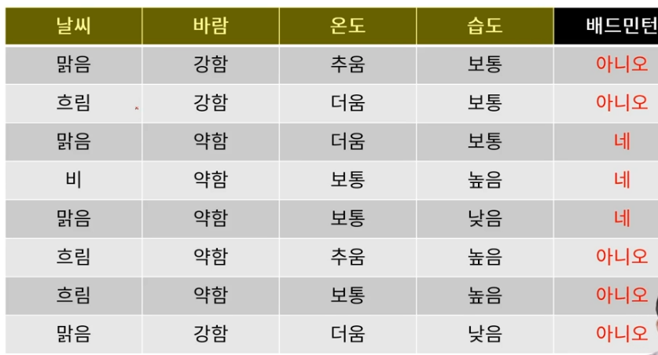
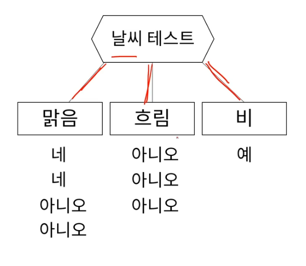
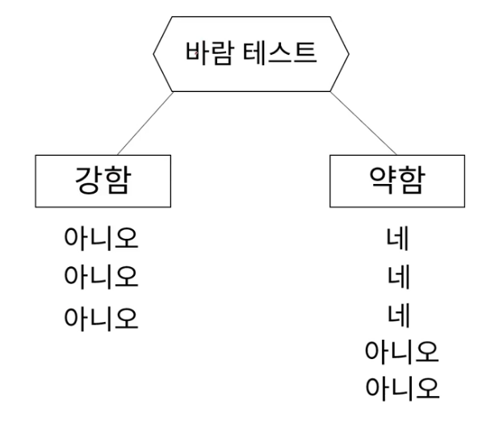
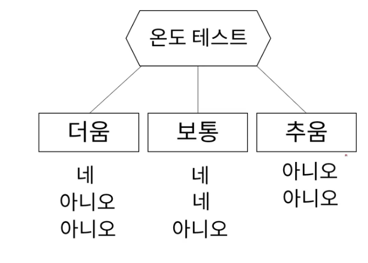
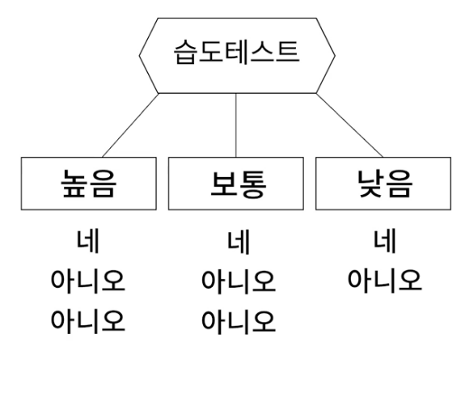

### Decision Tree 와 Random Forest 개념

1.  Decision Tree (의사결정 트리)

트리구조를 기반으로 의사결정을 하는 것이다.

트리구조는 CS(Computer Science) -- 자료구조 -- Tree 에서 시초가 되었다.

-   위의 사진에서 꼭짓점에서 있는 애들(테스트1, 네, 아니오)은 **Node**(노드)라고 한다.

그 중에서 **테스트1은 root node(루트 노드,부모 노드) / '네.아니오'는 leaf node(리프 노드, 자식 노드)라고 한다.**

-   테스트의 결과가 원하는 답이 안나왔다면, 다른 테스트를 만들면 된다. 그러면 Tree 구조로 쫙 나가는 형태가 된다.

-   **좋은 Decision Tree** **란?**

    -   가능한 한 가장 작은 나무를 사용하는 것이다.

    -   테스트의 갯수가 많아지게 된다면 알고리즘 돌아가는 시간이 늘어나고, 사용하는 리소스도 많아지게 되기 때문이다.

    -   하지만, 만약 테스트의 갯수를 많이 써야되는 상황이라면?

        -   성능 좋은 테스트 순서대로 선발해야한다!

-   

    Q)  가장 성능 좋은 테스트를 찾아봅시다.

위의 데이터를 기반으로 가장 성능 좋은 테스트를 찾아봅시다.

우선 위의 데이터는 4개의 피쳐가 있으니, 순차적으로 날씨 \~ 습도 순으로 테스트를 해보겠습니다.

-   날씨를 기준으로 한 테스트

{width="343"}

'날씨 = 맑음' 을 제외하고는 잘 구분이 되어 있습니다. 왜냐하면 '예, 아니요' 가 섞이지 않고 단일형태로 잘 구분되어 있기 떄문입니다. 반면에 '날씨 = 맑음' 일 경우에는 "예,아니요" 가 섞여있기에 좋지 않은 결과물이고, 따로 테스트를 한번 더 해야하는 경우입니다.\
테스트를 했으니 점수를 매겨야하는데, 보기 쉽게 1점씩 부여하겠습니다.\
날씨를 기준으로 한 테스트에서 4개가 잘 구분되어 있기 때문에 총 4점을 부여하겠습니다.

-   바람을 기준으로 한 테스트

{width="346"}

바람을 기준으로 한 테스트의 점수는 총 3점 (이유는 날씨기준에서 한 테스트를 보면 됩니다.)

-   온도 테스트

{width="388"}

온도를 기준으로 한 테스트의 총 점수는 2점입니다.

-   습도 테스트

{width="353"}

습도를 기준으로 한 테스트의 점수는 총 0점이다 .

-   개별 테스트 결과

날씨 테스트 = 4점 / 바람 테스트 = 3점 / 온도 테스트 = 2점 / 습도 테스트 = 0점이므로

첫 테스트는 날씨 테스트를 선택하며, 그 다음으로 순차적으로 선택한다.
